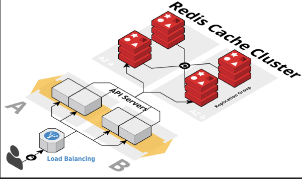

# Redis Module

This is a Python module for caching and tracking function calls using Redis. It provides decorators for tracking the number of times a function is called and for storing the input and output of the function calls in a Redis database. Additionally, it allows you to replay the function calls along with their inputs and outputs. 

## Prerequisites

- Python 3
- Redis server running locally or accessible via the default Redis connection settings.

## Installation

To use this module, you'll need to install the `redis` Python library. You can do this using `pip`:

```bash
pip install redis
```

## Usage

To use this module, you should import it in your Python code. Here's how you can use it:

```python
import redis
import uuid
from typing import Union, Callable, Optional
from functools import wraps
```

### Decorators

The module provides two decorators that can be applied to functions:

#### 1. `count_calls`

This decorator counts the number of times a function is called and stores the count in Redis.

Usage:

```python
@count_calls
def your_function_name(args):
    # Your function logic here
```

#### 2. `call_history`

This decorator records the inputs and outputs of a function and stores them in Redis.

Usage:

```python
@call_history
def your_function_name(args):
    # Your function logic here
```

### Class: `Cache`

The `Cache` class is designed to interact with Redis and provides the following methods:

#### `store`

This method stores data in Redis and returns a unique identifier (UUID) for that data.

Usage:

```python
cache = Cache()
key = cache.store("your_data")
```

#### `get`

This method retrieves data from Redis using the provided key. It can also apply an optional function to transform the retrieved value.

Usage:

```python
value = cache.get(key)
```

You can also use it with an optional function:

```python
value = cache.get(key, int)  # Convert the value to an integer
```

#### `get_int` and `get_str`

These methods are shortcuts to retrieve data as integers and strings, respectively.

Usage:

```python
int_value = cache.get_int(key)  # Get the value as an integer
str_value = cache.get_str(key)  # Get the value as a string
```

### Replay

The `replay` function allows you to replay the function calls along with their inputs and outputs. Here's how to use it:

```python
replay(your_function_name)
```

## Example

Here's a simple example of how you can use this module:

```python
# Import the module and create a Cache instance
from redis_module import Cache, replay

cache = Cache()

@count_calls
@call_history
def multiply(a, b):
    result = a * b
    return result

# Perform some function calls
multiply(2, 3)
multiply(4, 5)

# Replay the function calls
replay(multiply)
```

Running this code will display the number of times the `multiply` function was called and the details of each call, including the inputs and outputs.

Please ensure that you have a running Redis server and appropriate access when using this module.

## License

This module is provided under the MIT License. You can find the license details in the `LICENSE` file.
