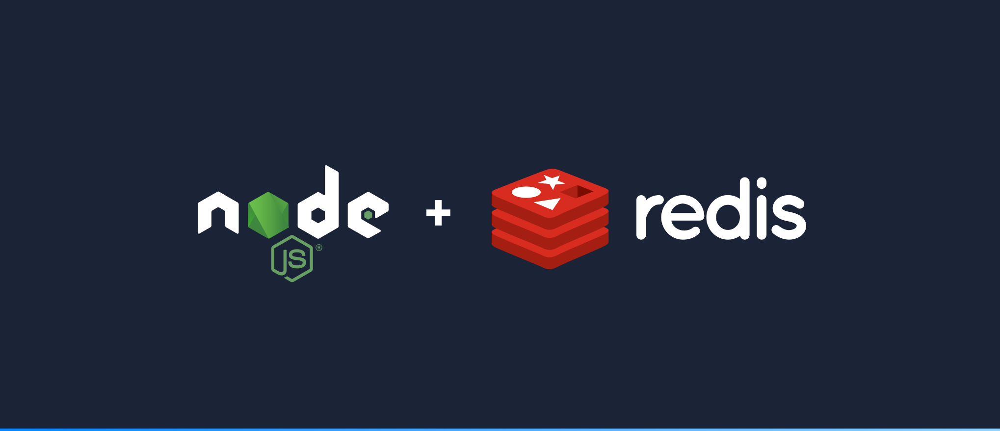

# Queuing System in JavaScript with Redis

## Description

This project provides a hands-on learning experience in setting up and using Redis, a popular in-memory data store, within the context of JavaScript applications. You'll explore various aspects of working with Redis, including basic operations, hash value storage, asynchronous operations, and building web applications with Express.js.

## Technologies Used

- Node.js
- Redis
- Kue
- Express.js

## Getting Started

To get started with this project, follow these steps:

 ### 1. **Clone the Repository:**
   
   ```bash
   git clone https://github.com/your-username/your-repository.git

### 2. How to run simple operations with the Redis client

To run simple operations with the Redis client, you can follow these steps:

- First, make sure you have Redis installed and running on your machine.
- Use a Redis client library, such as node_redis for Node.js, to connect to your Redis server.
- Perform basic operations like setting and getting key-value pairs using the client's methods, such as set and get.
- Don't forget to handle error cases and close the connection when you're done.
  
### 3. How to use a Redis client with Node JS for basic operations

### To use a Redis client with Node.js for basic operations, follow these steps:

- Install the node_redis library using npm or yarn: npm install redis or yarn add redis.
- Import the library into your Node.js application.
- Create a Redis client using the createClient method.
- Use the client to perform basic Redis operations like setting and getting values, working with lists, sets, and other data structures.
- Handle asynchronous operations and errors appropriately using callbacks or promises.
- How to store hash values in Redis

### Storing hash values in Redis can be done as follows:

Use the HSET or equivalent method of your Redis client to store key-value pairs within a hash. For example, HSET myHashField myKey myValue.
The myHashField represents the name of the hash, myKey is the field or key within the hash, and myValue is the value associated with that key.
You can set multiple key-value pairs within the same hash by repeating the HSET operation with different keys and values.
Hashes in Redis are useful for organizing and storing structured data. You can use other hash-related operations like HGET, HMGET, and HDEL to retrieve and manipulate hash values as needed.

### Summary 
This project offers an insightful journey into working with Redis, Node.js, and queuing systems. By exploring the fundamental concepts of Redis, you have learned how to set up and run a Redis server on your local machine, perform basic operations with the Redis client, and store hash values efficiently.


